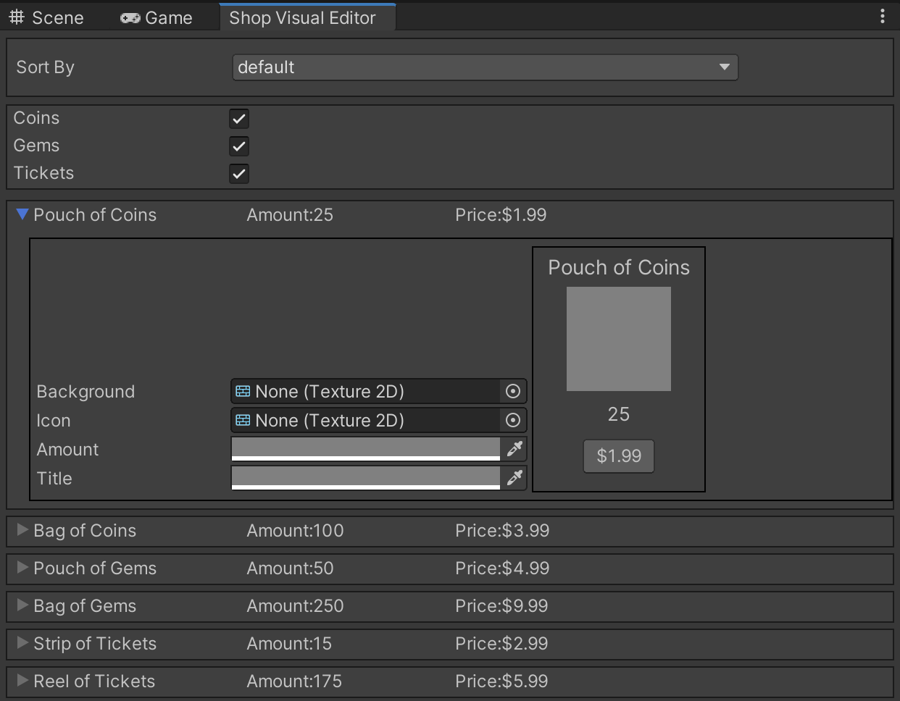

# UIElements / UIToolkit Shop System

An example editor tool I made using the new UI Toolkit(formerly UIElements)

The tool is made for artists to visualize and customize items such as in-app purchases (coins, gems, tickets etc) without having to manually change them in the scene or prefabs. It built purely using UIElements scripting. Although, the recommended approach is to have layouts and styles in there respective uxml and uss files

The tool also consists filterting, single and multiple criteria sorting (by price, name, item type etc.)

Icon pack used: https://assetstore.unity.com/packages/2d/gui/icons/rpg-inventory-icons-56687

